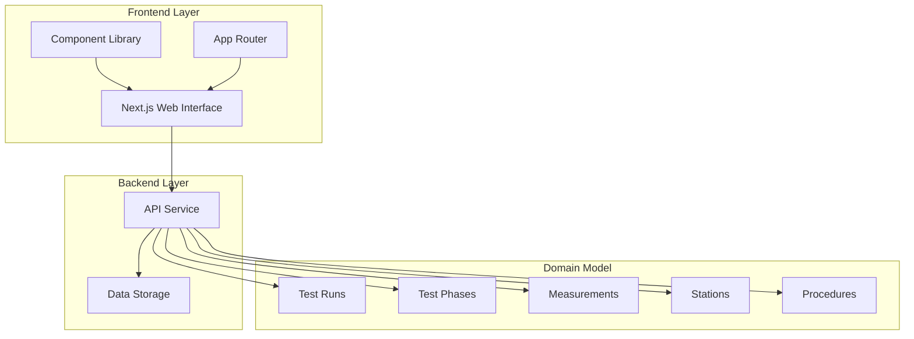
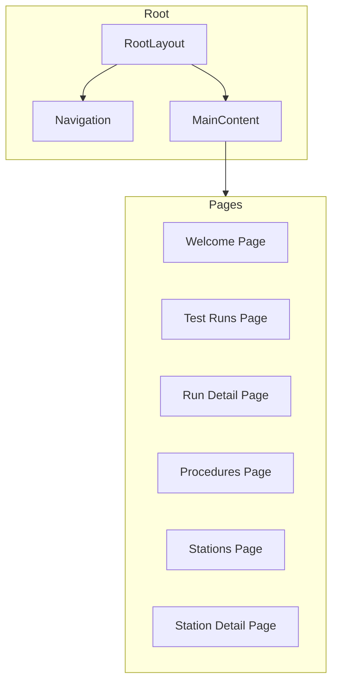
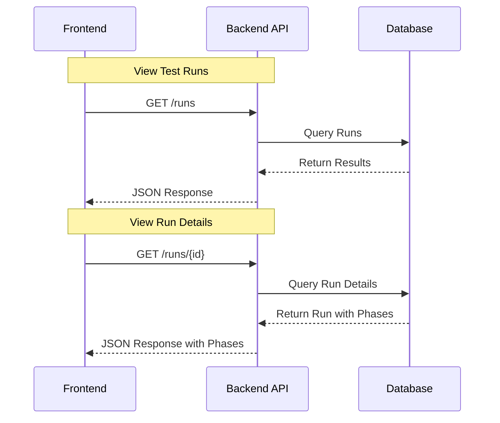

# NotTofu - Simple Todo Application

<div align="center">
  
</div>

## Quick Start

Start the application with a single command:

```bash
npm start
```

This command will:
- Check if your environment is properly set up
- Install any missing dependencies
- Start both backend (port 3001) and frontend (port 3000) servers
- Display all log output in a single console

### Alternative Start Commands

- Windows: `npm run start:win` or run `start.bat`
- macOS/Linux: `npm run start:unix` or run `./start.sh`

NotTofu is a comprehensive test management platform designed to streamline and automate the testing process. It helps teams manage test procedures, execute test runs across different stations, collect and analyze test data, and generate insightful reports.

## Quick Start 🚀

### One Command to Run Everything!

```bash
npm start
```

This single command will:
- Check if setup is needed and install dependencies if necessary
- Start both backend and frontend servers
- Display log output from both servers in a single console

*Note: This will automatically choose the appropriate startup script for your operating system (Windows, macOS, or Linux).*

### Alternative Start Commands

**Windows Users:**
```powershell
# Using PowerShell
.\start.ps1

# Using command prompt
start.bat
```

**macOS/Linux Users:**
```bash
# Make executable (first time only)
chmod +x start.sh

# Run
./start.sh
```

## Project Structure

This project consists of two main parts:
- **Root project**: API/backend services (Next.js API routes)
- **Frontend**: Next.js application in the `/frontend` directory

```
/
├── app/                    # Root Next.js app (API backend)
├── frontend/               # Frontend Next.js application
│   ├── app/                # Frontend pages and routes
│   │   ├── runs/           # Test runs pages
│   │   ├── stations/       # Stations pages
│   │   ├── procedures/     # Procedures pages
│   │   ├── docs/           # Documentation pages
│   │   └── ...
│   ├── components/         # Reusable components
│   └── public/             # Static assets
├── start.bat               # Windows batch startup script
├── start.ps1               # PowerShell startup script
├── start.sh                # Unix/Linux bash startup script
├── setup.ps1               # PowerShell setup script
├── setup.sh                # Bash setup script
└── package.json            # Root package configuration
```

## System Architecture

### Overall Design



### Frontend Components



## Prerequisites

- [Node.js](https://nodejs.org/) (v16 or later)
- npm (included with Node.js)

## Manual Setup (if needed)

### Windows

```powershell
# Option 1: Using PowerShell script directly
.\setup.ps1

# Option 2: Using npm script
npm run setup
```

### macOS/Linux

```bash
# Option 1: Using bash script directly
chmod +x setup.sh
./setup.sh

# Option 2: Using npm script
npm run setup:unix
```

## Manual Development

### Starting Development Servers Manually

If you prefer to start servers separately:

```powershell
# Backend (root project)
npm run dev:root  # Runs on port 3001

# Frontend
npm run dev:frontend  # Runs on port 3000
```

### Port Configuration Notes

- **Backend API**: http://localhost:3001
- **Frontend**: http://localhost:3000

## Building for Production

Build both projects:

```bash
npm run build:all
```

## Starting Production Servers

Start both servers:

```bash
npm run start:all
```

## Key Features

- **Test Runs Management**: Create, track, and analyze test runs
- **Station Configuration**: Configure and manage test stations
- **Procedure Management**: Define and maintain test procedures
- **Data Analytics**: Gain insights from your test data

### Data Flow



## Documentation

Detailed documentation is available in the `docs` directory:

- **Architecture**
  - [System Overview](docs/architecture/system_overview.md)
  - [Frontend Architecture](docs/architecture/frontend_architecture.md)
- **API**
  - API documentation is available in the `docs/api` directory
- **Roadmap**
  - [Project Roadmap](docs/roadmap.md)

For local development, access documentation at:
- [User Guides](http://localhost:3000/docs)

## Troubleshooting

### PowerShell Command Syntax
Windows PowerShell doesn't support the `&&` operator for command chaining. Use semicolons instead:
```powershell
# This works
cd frontend; npm run dev

# This doesn't work in PowerShell
cd frontend && npm run dev
```

### Port Conflicts
If you encounter port conflicts, the startup scripts will handle them automatically. You will see messages like:
```
⚠ Port 3000 is in use, trying 3001 instead.
```

## License

[MIT](LICENSE) 
