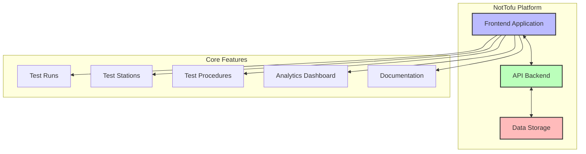
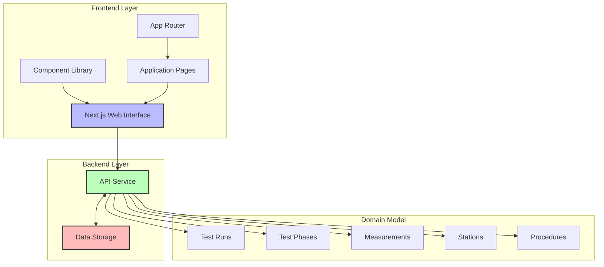
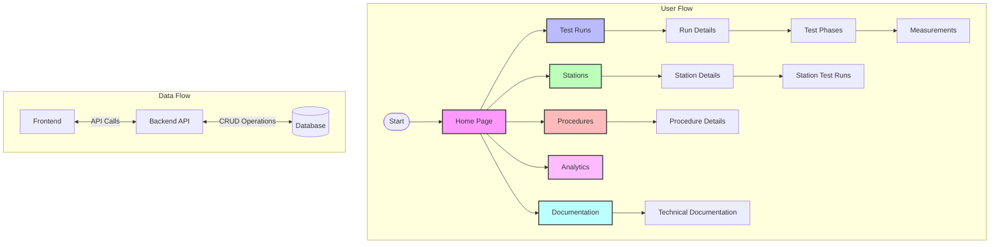
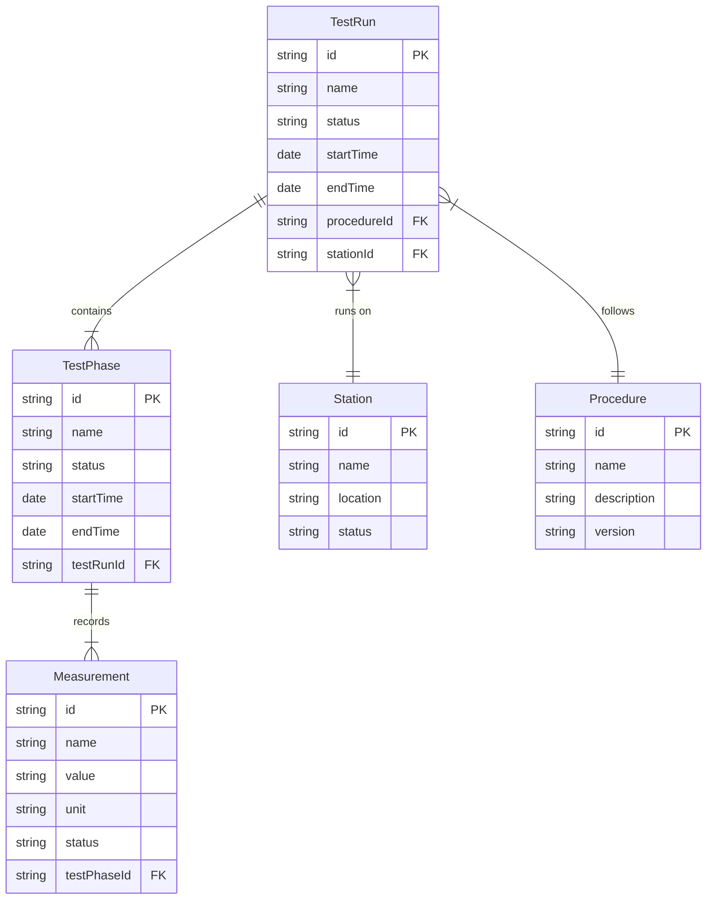

# NotTofu - Hardware Test Automation Manager

<div align="center">
  
</div>

## Overview

NotTofu is a comprehensive test management platform designed to streamline hardware testing workflows. It helps teams manage test procedures, execute test runs across different stations, collect and analyze test data, and generate insightful reports.



## Quick Start

Start the application with a single command:

```bash
npm start
```

This command will:
- Check if your environment is properly set up
- Install any missing dependencies
- Start both backend (port 8000) and frontend (port 3000) servers
- Display all log output in a single console

### Customizable Ports

You can now specify custom ports for both the backend and frontend:

```bash
# Windows
start.bat 9000 4000  # Backend on port 9000, frontend on port 4000

# Linux/macOS
./start.sh 9000 4000  # Backend on port 9000, frontend on port 4000
```

For detailed installation and setup instructions with visual diagrams, see our [Installation Guide](docs/installation.md).

## New Features and Updates

### Enhanced UI Experience
- **Centered Logo**: Improved homepage with a centered logo for better visual hierarchy
- **Restored Navigation Links**: Full navigation bar with icons throughout the application
- **Consistent Layout**: Standardized layout across all pages for better user experience

### Technical Documentation
- **Interactive Documentation Page**: New `/docs/technical` page with comprehensive technical documentation
- **Interactive Mermaid Diagrams**: Visual representation of system architecture, data models, and workflows
- **Centralized Knowledge Base**: All architectural information in one place for easy reference

## Project Structure

This project consists of two main parts:
- **Root project**: API/backend services (FastAPI backend)
- **Frontend**: Next.js application in the `/frontend` directory

```
/
├── app/                    # Root FastAPI app (API backend)
├── frontend/               # Frontend Next.js application
│   ├── app/                # Frontend pages and routes
│   │   ├── runs/           # Test runs pages
│   │   ├── stations/       # Stations pages
│   │   ├── procedures/     # Procedures pages
│   │   ├── analytics/      # Analytics dashboard
│   │   ├── docs/           # Documentation pages
│   │   │   └── technical/  # Technical documentation with diagrams
│   │   ├── settings/       # Settings pages
│   │   ├── account/        # Account management
│   │   ├── status/         # API status
│   │   └── ...
│   ├── components/         # Reusable components
│   └── public/             # Static assets
├── docs/                   # Documentation and diagrams
├── start.bat               # Windows batch startup script
├── start.ps1               # PowerShell startup script
├── start.sh                # Unix/Linux bash startup script
├── setup.ps1               # PowerShell setup script
├── setup.sh                # Bash setup script
└── package.json            # Root package configuration
```

## System Architecture



## Application Flow



## Data Model



## Technical Documentation

The application now includes a comprehensive technical documentation page at `/docs/technical` that provides:

- System overview with architecture diagrams
- User and data flow visualizations
- Frontend component hierarchy
- API endpoint structure and sequence diagrams
- Deployment architecture and script flow
- Project roadmap and feature timeline

Visit the technical documentation page in the application to view all diagrams and explanations.

## Prerequisites

- [Node.js](https://nodejs.org/) (v16 or later)
- npm (included with Node.js)

## Manual Setup (if needed)

### Windows

```powershell
# Option 1: Using PowerShell script directly
.\setup.ps1

# Option 2: Using npm script
npm run setup
```

### macOS/Linux

```bash
# Option 1: Using bash script directly
chmod +x setup.sh
./setup.sh

# Option 2: Using npm script
npm run setup:unix
```

## Manual Development

### Starting Development Servers Manually

If you prefer to start servers separately:

```powershell
# Backend (root project)
npm run dev:root  # Runs on port 8000

# Frontend
npm run dev:frontend  # Runs on port 3000
```

### Port Configuration Notes

- **Backend API**: http://localhost:8000
- **Frontend**: http://localhost:3000

## Building for Production

Build both projects:

```bash
npm run build:all
```

## Starting Production Servers

Start both servers:

```bash
npm run start:all
```

## Key Features

- **Test Runs Management**: Create, track, and analyze test runs
- **Station Configuration**: Configure and manage test stations
- **Procedure Management**: Define and maintain test procedures
- **Analytics Dashboard**: Gain insights from your test data
- **Documentation System**: Access system and user documentation, including interactive technical diagrams
- **Settings Management**: Configure application settings
- **Account Management**: Manage user accounts and permissions (coming soon)

## Implementation Status

| Feature | Status |
|---------|--------|
| Navigation System | ✅ Complete |
| Test Runs Management | ✅ Complete |
| Stations Management | ✅ Complete |
| Procedures Management | ✅ Complete |
| API Status Monitoring | ✅ Complete |
| Technical Documentation | ✅ Complete |
| Home Page Layout | ✅ Complete |
| Analytics Dashboard | 🔄 In Progress |
| User Documentation | 🔄 In Progress |
| Settings Management | 🔄 In Progress |
| Account Management | 🔄 In Progress |
| Mobile Responsiveness | 🔄 In Progress |
| Authentication System | ⏳ Planned |
| Export & Reporting | ⏳ Planned |
| Real-time Updates | ⏳ Planned |

## License

[MIT](LICENSE)

## Examples

The repository includes example test scripts in the `examples/` directory that demonstrate how to use NotTofu for test management:

- **Simple Tests**: Basic examples of creating and recording test data
- **Complex Tests**: More advanced tests with detailed measurements and reporting
- **Hardware Tests**: Simulated examples of hardware testing (motors, etc.)
- **Batch Testing**: Tools for running multiple tests in sequence

To get started with the examples:

```bash
# Start the NotTofu application
npm start

# In a separate terminal, run an example test
python examples/test_samples/simple_test.py
```

See the [Examples README](examples/README.md) for more details.

# Example Test Scripts

The `examples` directory contains several test scripts that demonstrate how to use the NotTofu API:

- `simple_test.py`: Basic test with phases and measurements
- `complex_test.py`: More advanced test with detailed reporting
- `hw_motor_test.py`: Specialized test for motor hardware
- `batch_test_runner.py`: Utility for running multiple tests

The examples are fully functional and will create test runs in the NotTofu database. To run them:

```bash
# Start the backend server
python -m uvicorn app.main:app --reload

# Run a simple test example
python examples/test_samples/simple_test.py

# Run a complex test with parameters
python examples/test_samples/complex_test.py --device-id DEV123 --serial SN456
```

See the `examples/README.md` for more details on how to use and customize these examples. 
