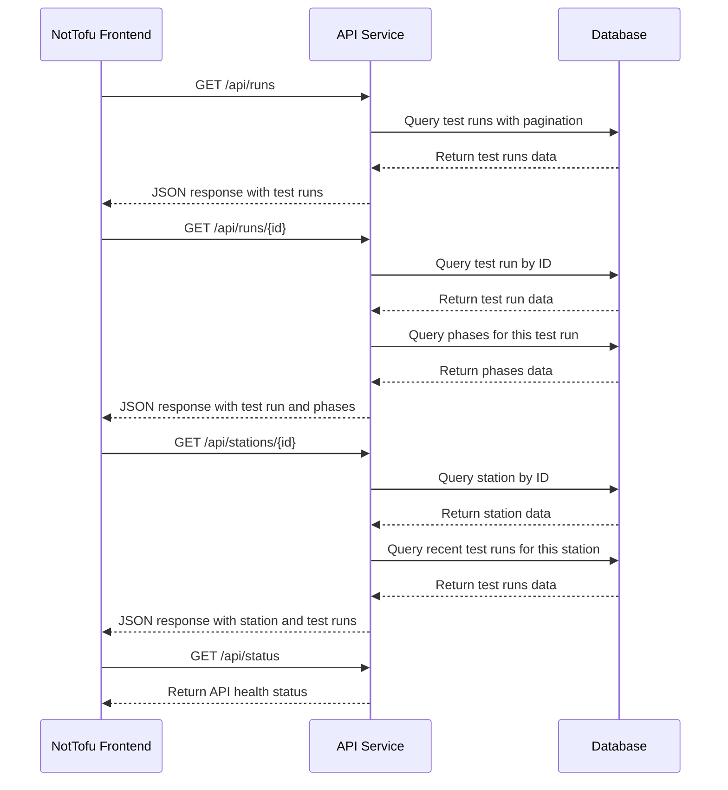
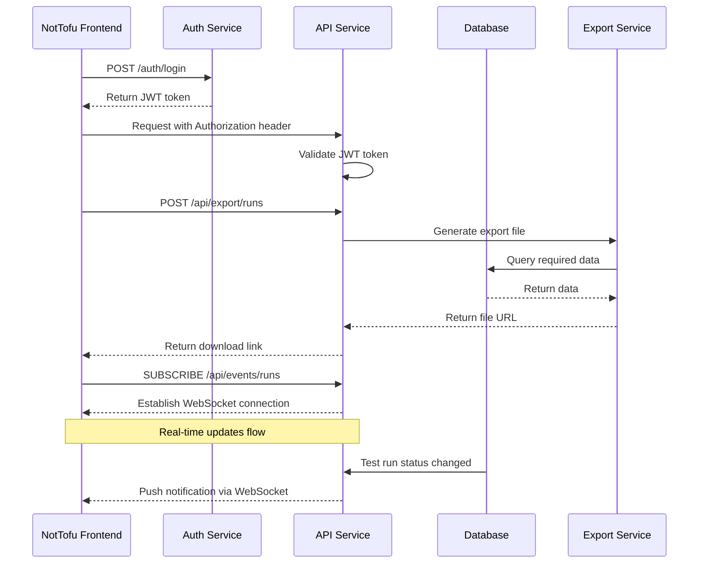

# API Flows

## Current API Flows



## API Endpoint Structure

```mermaid
graph TB
    API[API Root]
    
    Runs[/runs]
    RunById[/runs/{id}]
    RunPhases[/runs/{id}/phases]
    
    Stations[/stations]
    StationById[/stations/{id}]
    StationRuns[/stations/{id}/runs]
    
    Procedures[/procedures]
    ProcedureById[/procedures/{id}]
    
    Status[/status]
    
    API --> Runs
    API --> RunById
    API --> RunPhases
    
    API --> Stations
    API --> StationById
    API --> StationRuns
    
    API --> Procedures
    API --> ProcedureById
    
    API --> Status
```

## Data Retrieval Patterns

### Listing Test Runs
```
GET /api/runs
```

**Query Parameters:**
- `page`: Page number (default: 1)
- `limit`: Items per page (default: 20)
- `sort`: Sort field (default: startTime)
- `order`: Sort order (asc/desc, default: desc)
- `stationId`: Filter by station ID
- `procedureId`: Filter by procedure ID
- `status`: Filter by status

**Response:**
```json
{
  "data": [
    {
      "id": "run123",
      "name": "Daily Check Run",
      "status": "COMPLETE",
      "startTime": "2024-04-15T09:30:00Z",
      "endTime": "2024-04-15T10:15:00Z",
      "stationId": "station1",
      "stationName": "Main Test Station",
      "procedureId": "proc1",
      "procedureName": "Daily Check Procedure"
    }
    // More test runs...
  ],
  "pagination": {
    "page": 1,
    "limit": 20,
    "total": 45,
    "pages": 3
  }
}
```

### Retrieving Test Run Details
```
GET /api/runs/{id}
```

**Response:**
```json
{
  "id": "run123",
  "name": "Daily Check Run",
  "status": "COMPLETE",
  "description": "Regular daily verification",
  "startTime": "2024-04-15T09:30:00Z",
  "endTime": "2024-04-15T10:15:00Z",
  "stationId": "station1",
  "stationName": "Main Test Station",
  "procedureId": "proc1",
  "procedureName": "Daily Check Procedure",
  "phases": [
    {
      "id": "phase1",
      "name": "System Startup",
      "status": "PASS",
      "startTime": "2024-04-15T09:30:00Z",
      "endTime": "2024-04-15T09:35:00Z"
    },
    {
      "id": "phase2",
      "name": "Calibration",
      "status": "PASS",
      "startTime": "2024-04-15T09:35:00Z",
      "endTime": "2024-04-15T09:50:00Z"
    }
    // More phases...
  ]
}
```

### Retrieving Station Details
```
GET /api/stations/{id}
```

**Response:**
```json
{
  "id": "station1",
  "name": "Main Test Station",
  "description": "Primary calibration station",
  "location": "Building A, Room 101",
  "status": "OPERATIONAL",
  "recentRuns": [
    {
      "id": "run123",
      "name": "Daily Check Run",
      "status": "COMPLETE",
      "startTime": "2024-04-15T09:30:00Z",
      "endTime": "2024-04-15T10:15:00Z"
    }
    // More recent runs...
  ]
}
```

### API Status Check
```
GET /api/status
```

**Response:**
```json
{
  "status": "operational",
  "version": "1.0.0",
  "uptime": "10d 5h 30m",
  "services": {
    "database": "connected",
    "storage": "connected",
    "cache": "connected"
  },
  "latency": {
    "database": "15ms",
    "api": "45ms"
  }
}
```

## Known Issues and Resolutions

### 404 Errors for Test Runs

Currently, the system logs show 404 errors when accessing `/test-runs/` endpoints:

```
::1 - - [05/Apr/2025 19:54:56] code 404, message File not found
::1 - - [05/Apr/2025 19:54:56] "GET /test-runs/ HTTP/1.1" 404 -
```

**Resolution:** 
The API endpoint path should be updated to use `/runs/` instead of `/test-runs/`. The frontend should be updated to align with this endpoint structure. All references to "test-runs" in frontend code should be changed to "runs" to match the backend API structure.

```diff
- fetch('/api/test-runs')
+ fetch('/api/runs')
```

## Planned API Extensions



## Implementation Status

- ✅ Runs listing and filtering
- ✅ Run details
- ✅ Station details
- ✅ Test phases within runs
- ✅ API status endpoint
- 🔄 Advanced filtering and search
- ⏳ Authentication and authorization
- ⏳ Data export functionality
- ⏳ Real-time updates

## API Development Guidelines

1. **RESTful Design**
   - Use proper HTTP methods (GET, POST, PUT, DELETE)
   - Resource-oriented endpoints
   - Consistent response formats

2. **Error Handling**
   - Meaningful HTTP status codes
   - Detailed error messages
   - Validation error reporting

3. **Performance Considerations**
   - Pagination for list endpoints
   - Selective field inclusion
   - Query optimization

4. **Security**
   - Input validation
   - JWT-based authentication (planned)
   - Role-based access control (planned) 