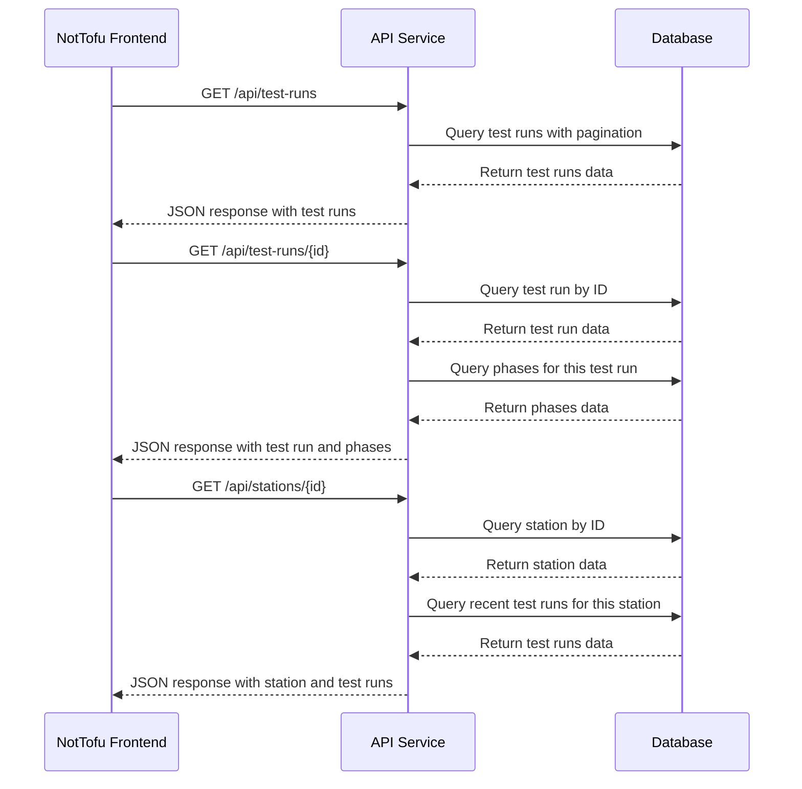

# API Flows

## Current API Flows



## Data Retrieval Patterns

### Listing Test Runs
```
GET /api/test-runs
```

**Query Parameters:**
- `page`: Page number (default: 1)
- `limit`: Items per page (default: 20)
- `sort`: Sort field (default: startTime)
- `order`: Sort order (asc/desc, default: desc)
- `stationId`: Filter by station ID
- `procedureId`: Filter by procedure ID
- `status`: Filter by status

**Response:**
```json
{
  "data": [
    {
      "id": "run123",
      "name": "Daily Check Run",
      "status": "COMPLETE",
      "startTime": "2024-04-15T09:30:00Z",
      "endTime": "2024-04-15T10:15:00Z",
      "stationId": "station1",
      "stationName": "Main Test Station",
      "procedureId": "proc1",
      "procedureName": "Daily Check Procedure"
    }
    // More test runs...
  ],
  "pagination": {
    "page": 1,
    "limit": 20,
    "total": 45,
    "pages": 3
  }
}
```

### Retrieving Test Run Details
```
GET /api/test-runs/{id}
```

**Response:**
```json
{
  "id": "run123",
  "name": "Daily Check Run",
  "status": "COMPLETE",
  "description": "Regular daily verification",
  "startTime": "2024-04-15T09:30:00Z",
  "endTime": "2024-04-15T10:15:00Z",
  "stationId": "station1",
  "stationName": "Main Test Station",
  "procedureId": "proc1",
  "procedureName": "Daily Check Procedure",
  "phases": [
    {
      "id": "phase1",
      "name": "System Startup",
      "status": "PASS",
      "startTime": "2024-04-15T09:30:00Z",
      "endTime": "2024-04-15T09:35:00Z"
    },
    {
      "id": "phase2",
      "name": "Calibration",
      "status": "PASS",
      "startTime": "2024-04-15T09:35:00Z",
      "endTime": "2024-04-15T09:50:00Z"
    }
    // More phases...
  ]
}
```

### Retrieving Station Details
```
GET /api/stations/{id}
```

**Response:**
```json
{
  "id": "station1",
  "name": "Main Test Station",
  "description": "Primary calibration station",
  "location": "Building A, Room 101",
  "status": "OPERATIONAL",
  "recentRuns": [
    {
      "id": "run123",
      "name": "Daily Check Run",
      "status": "COMPLETE",
      "startTime": "2024-04-15T09:30:00Z",
      "endTime": "2024-04-15T10:15:00Z"
    }
    // More recent runs...
  ]
}
```

## Planned API Extensions


## Implementation Status

- ✅ Test runs listing and filtering
- ✅ Test run details
- ✅ Station details
- ✅ Test phases within runs
- 🔄 Advanced filtering and search
- ⏳ Authentication and authorization
- ⏳ Data export functionality
- ⏳ Real-time updates

## API Development Guidelines

1. **RESTful Design**
   - Use proper HTTP methods (GET, POST, PUT, DELETE)
   - Resource-oriented endpoints
   - Consistent response formats

2. **Error Handling**
   - Meaningful HTTP status codes
   - Detailed error messages
   - Validation error reporting

3. **Performance Considerations**
   - Pagination for list endpoints
   - Selective field inclusion
   - Query optimization

4. **Security**
   - Input validation
   - JWT-based authentication (planned)
   - Role-based access control (planned) 