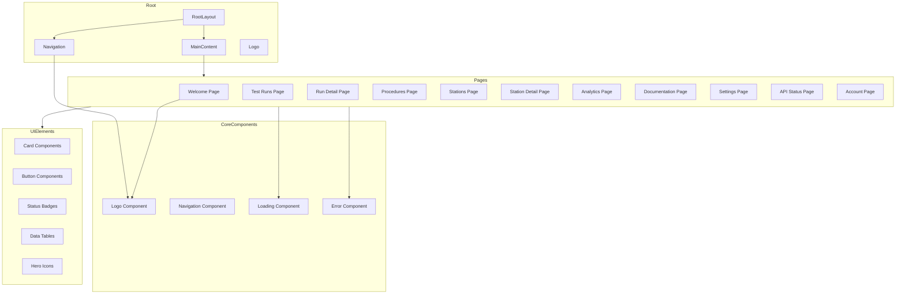
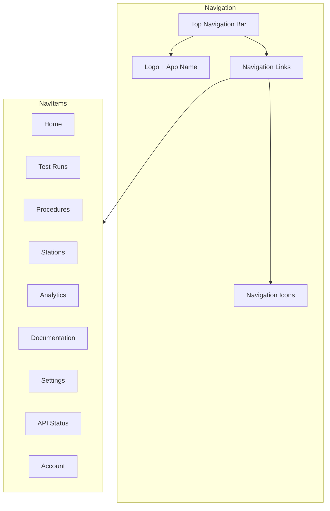
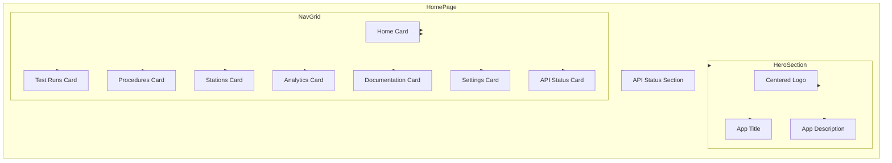
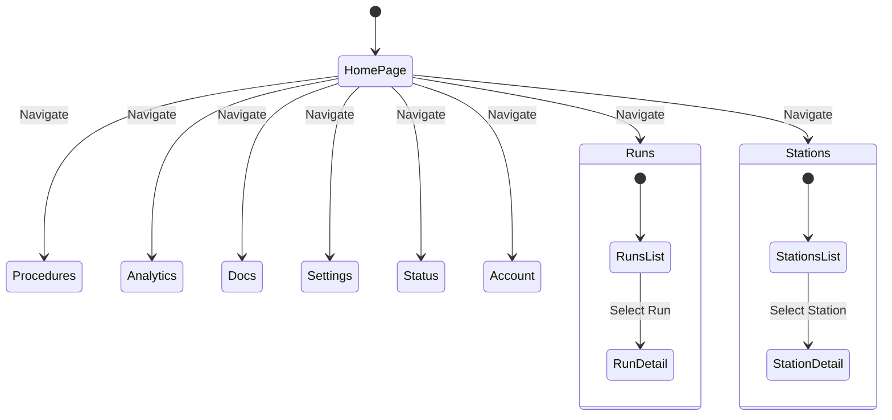
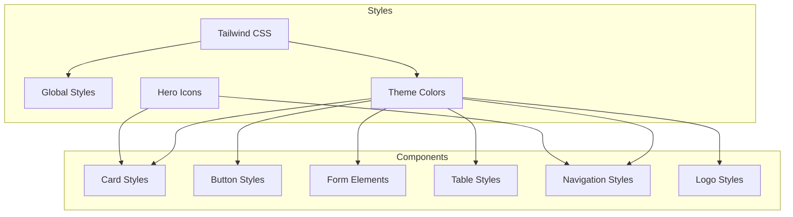

# Frontend Architecture

## Component Structure



## Navigation and Layout



## File Structure

```
frontend/
├── app/
│   ├── layout.tsx           # Root layout with navigation
│   ├── page.tsx             # Welcome page with centered logo
│   ├── loading.tsx          # Global loading component
│   ├── error.tsx            # Global error component
│   ├── config.ts            # Configuration including API URL
│   ├── globals.css          # Global styles
│   ├── runs/
│   │   ├── page.tsx         # Test runs list
│   │   └── [id]/
│   │       └── page.tsx     # Test run detail
│   ├── procedures/
│   │   └── page.tsx         # Procedures page
│   ├── stations/
│   │   ├── page.tsx         # Stations page
│   │   └── [id]/
│   │       └── page.tsx     # Station detail
│   ├── analytics/
│   │   └── page.tsx         # Analytics dashboard
│   ├── docs/
│   │   └── page.tsx         # Documentation page
│   ├── settings/
│   │   └── page.tsx         # Settings page
│   ├── status/
│   │   └── page.tsx         # API status page
│   └── account/
│       └── page.tsx         # Account management
├── components/
│   ├── Logo.tsx             # Logo component
│   └── Navigation.tsx       # Navigation component
├── tailwind.config.js       # Tailwind configuration
└── package.json             # Dependencies
```

## Component Hierarchy

```mermaid
graph TB
    subgraph Core Components
        Layout[layout.tsx]
        Navigation[Navigation.tsx]
        Logo[Logo.tsx]
        Loading[loading.tsx]
        Error[error.tsx]
    end

    subgraph Page Components
        Home[page.tsx]
        Runs[runs/page.tsx]
        RunDetail[runs/[id]/page.tsx]
        Procedures[procedures/page.tsx]
        Stations[stations/page.tsx]
        StationDetail[stations/[id]/page.tsx]
        Analytics[analytics/page.tsx]
        Docs[docs/page.tsx]
        Settings[settings/page.tsx]
        Status[status/page.tsx]
        Account[account/page.tsx]
    end

    Layout --> Navigation
    Navigation --> Logo
    Layout --> Home
    Layout --> Runs
    Layout --> RunDetail
    Layout --> Procedures
    Layout --> Stations
    Layout --> StationDetail
    Layout --> Analytics
    Layout --> Docs
    Layout --> Settings
    Layout --> Status
    Layout --> Account
    Layout --> Loading
    Layout --> Error
    Home --> Logo
```

## Homepage Structure



## UI Interaction Flow



## Styling System



## Implementation Status

1. **Completed Features**
   - ✅ Navigation system with all page links
   - ✅ Logo component with adjustable size
   - ✅ Home page with centered logo and navigation grid
   - ✅ Test runs pages
   - ✅ Procedures page
   - ✅ Stations pages
   - ✅ API Status page
   - ✅ Error and loading states

2. **In Progress**
   - 🔄 Analytics dashboard
   - 🔄 Documentation system
   - 🔄 Settings page
   - 🔄 Account management
   - 🔄 Mobile responsiveness

3. **Planned Features**
   - Authentication system
   - Advanced filtering
   - Data export
   - Real-time updates
   - Customizable dashboard 