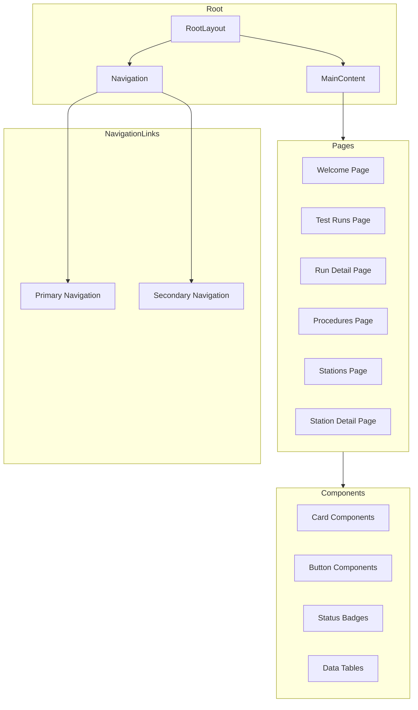
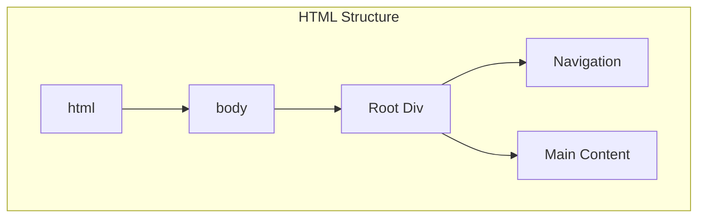
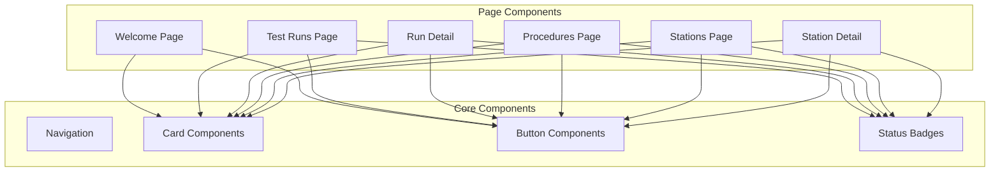
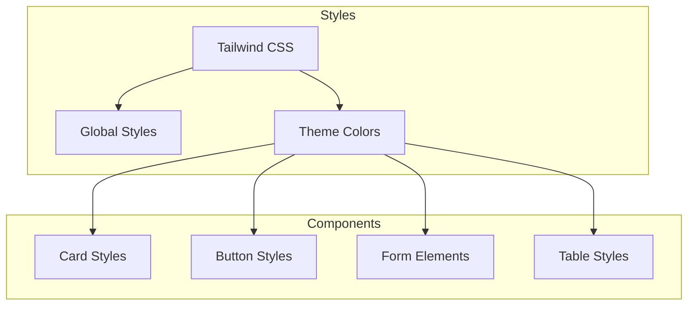
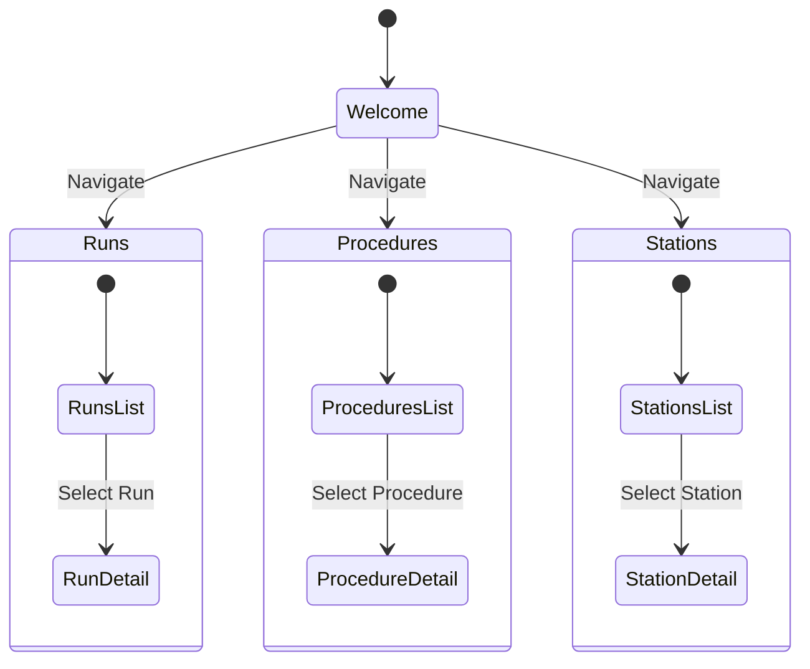

# Frontend Architecture

## Component Structure



## Layout Structure



## File Structure

```
frontend/
├── app/
│   ├── layout.tsx           # Root layout with navigation
│   ├── page.tsx             # Welcome page
│   ├── runs/
│   │   ├── page.tsx         # Test runs list
│   │   └── [id]/
│   │       └── page.tsx     # Test run detail
│   ├── procedures/
│   │   └── page.tsx         # Procedures page
│   ├── stations/
│   │   ├── page.tsx         # Stations page
│   │   └── [id]/
│   │       └── page.tsx     # Station detail
│   └── globals.css          # Global styles
├── components/
│   └── Navigation.tsx       # Navigation component
├── tailwind.config.js       # Tailwind configuration
└── package.json             # Dependencies
```

## Component Dependencies



## Styling System



## Key Features

1. **Layout System**
   - Top navigation bar with responsive design
   - Consistent page layout with proper spacing
   - Content sections with cards and containers

2. **Navigation**
   - Primary navigation links with icons
   - Active state highlighting
   - Secondary navigation for settings

3. **Components**
   - Card components for content grouping
   - Status badges (success, error, active)
   - Button components with different variants
   - Form input components

4. **Pages**
   - Welcome page with feature overview
   - Test runs list with filtering
   - Detailed run view with phases and logs
   - Procedures overview with categorization
   - Stations list and detailed station view

## UI State Flow



## Development Priorities

1. **Current Status**
   - ✅ Page layout with navigation
   - ✅ Welcome page
   - ✅ Test runs list and detail view
   - ✅ Procedures page
   - ✅ Stations page and detail view
   - ✅ Consistent styling with Tailwind

2. **Next Steps**
   - Improved form components
   - Advanced filtering and search
   - Data visualization components
   - Mobile responsiveness enhancements

3. **Upcoming Features**
   - Authentication and user profiles
   - Real-time updates
   - Customizable dashboards
   - Export and report generation 