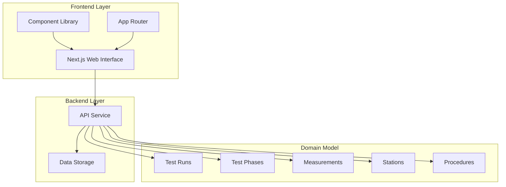
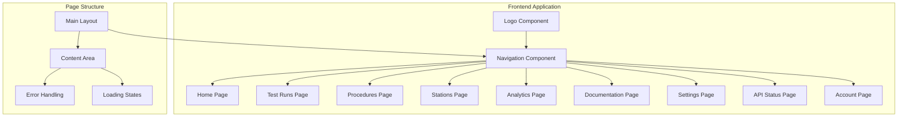
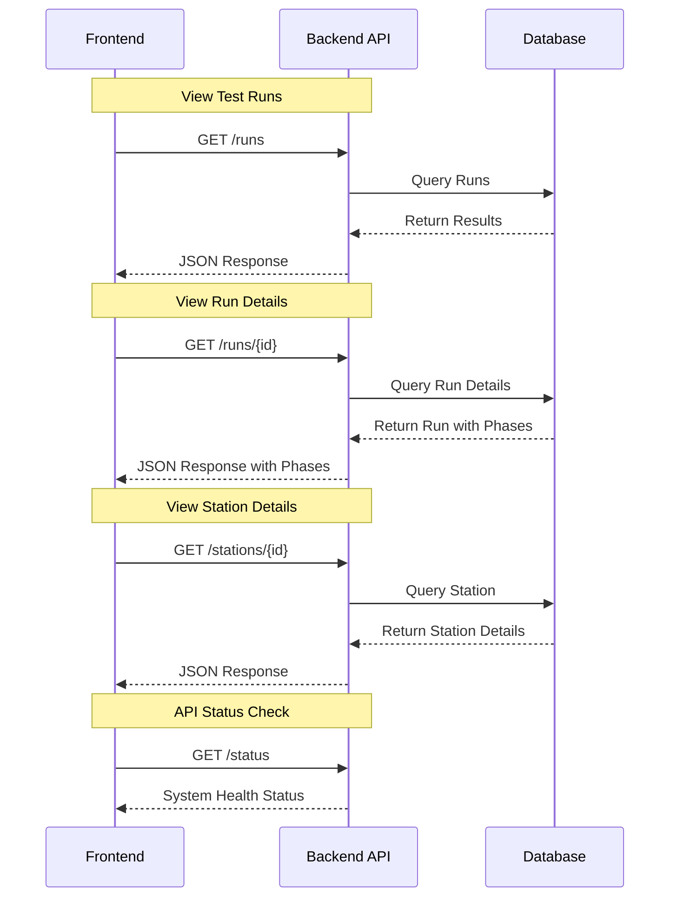
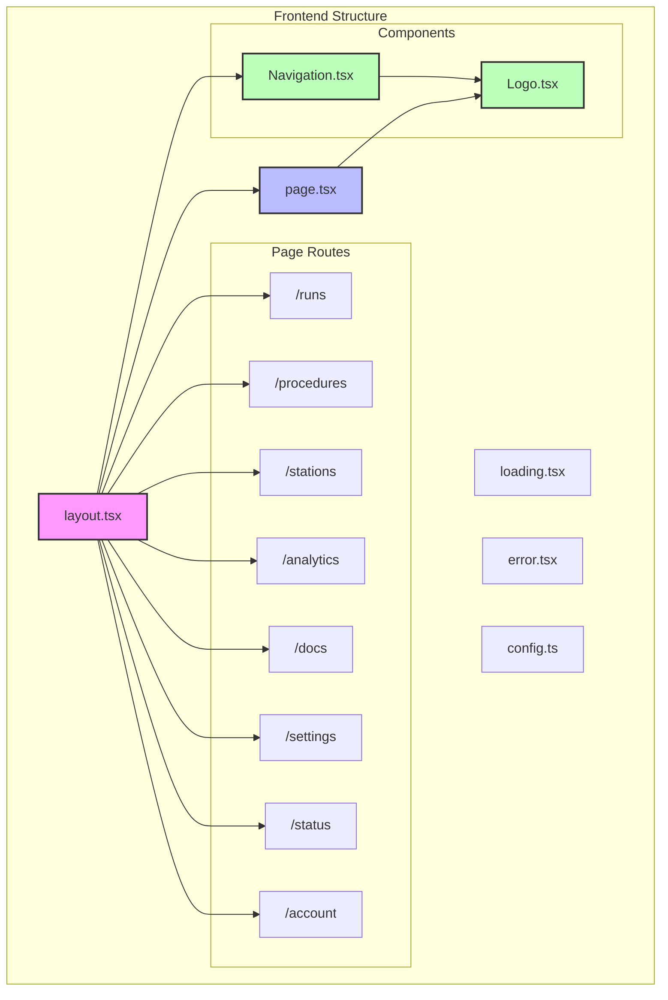

# System Architecture

## Overall System Design

## Application Structure

## Data Flow

## Current Architecture Implementation

## Implementation Status

### Frontend (Active Development)
1. **Completed**
   - ✅ Page layout with navigation
   - ✅ Welcome page with centered logo
   - ✅ Test runs list and detail view
   - ✅ Procedures page
   - ✅ Stations page and detail view
   - ✅ API Status page
   - ✅ Consistent styling with Tailwind

2. **In Progress**
   - 🔄 Account management
   - 🔄 Analytics dashboard
   - 🔄 Documentation system
   - 🔄 Settings page
   - 🔄 Mobile optimizations

3. **Planned**
   - Authentication and user management
   - Export and reporting
   - Customizable dashboard
   - Real-time updates

## Development Workflow

We follow a feature-based development workflow:

1. **Feature Planning**
   - Define requirements
   - Create UI mockups
   - Plan component structure

2. **Implementation**
   - Create/update components
   - Implement business logic
   - Add styling and interactions

3. **Testing**
   - Component testing
   - Integration testing
   - Responsive design testing

4. **Deployment**
   - Code review
   - Staging deployment
   - Production release 