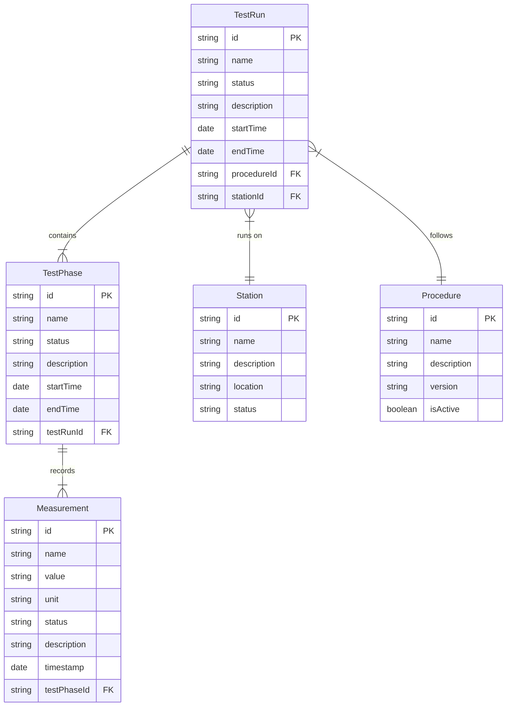

# Entity Relationships

## Current Entity Model

## Data Model Relationships

### Test Run
- A **TestRun** is the main entity representing an execution of a test
- Each TestRun is associated with exactly one **Station** where it runs
- Each TestRun follows exactly one **Procedure**
- A TestRun contains multiple **TestPhases**

### Test Phase
- A **TestPhase** represents a logical step in a test run
- Each TestPhase belongs to exactly one **TestRun**
- A TestPhase can record multiple **Measurements**

### Measurement
- A **Measurement** represents a single data point collected during testing
- Each Measurement belongs to exactly one **TestPhase**
- Measurements have a value, unit, and status (PASS/FAIL/etc.)

### Station
- A **Station** represents a physical testing station
- A Station can be used for multiple **TestRuns**
- Stations have a location and operational status

### Procedure
- A **Procedure** defines the test protocol to follow
- A Procedure can be used for multiple **TestRuns**
- Only active procedures can be used for new test runs

## Data Access Patterns

### Common Queries
1. Get all test runs for a specific station
2. Get all test runs using a specific procedure
3. Get test phases for a specific test run
4. Get measurements for a specific test phase
5. Get latest test run for a station/procedure combination

### Data Aggregations
1. Test pass/fail rates by station
2. Test duration statistics by procedure
3. Measurement trends over time
4. Station utilization metrics

## Implementation Notes

- Primary keys are represented as strings to maintain flexibility (UUID)
- Timestamps use ISO 8601 format for consistency
- Status fields use enumerated values (e.g., "RUNNING", "COMPLETE", "FAILED")
- All entities include audit fields (created/modified timestamps and users) in the actual implementation 