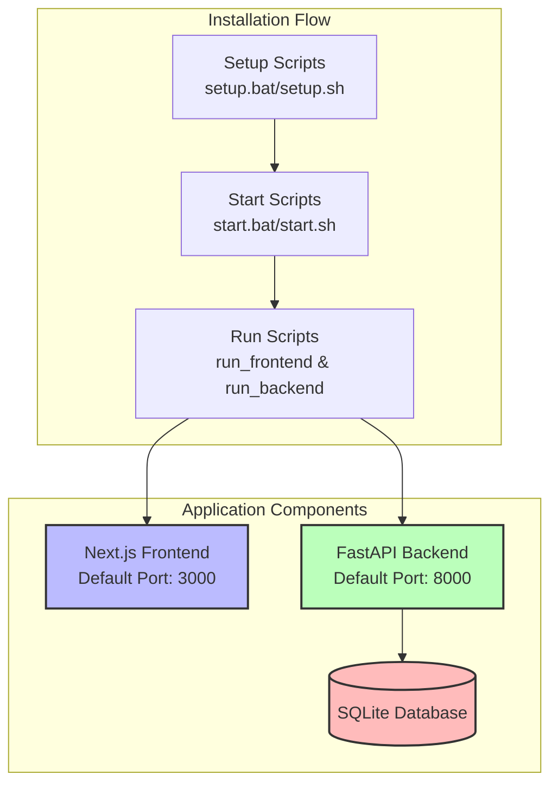
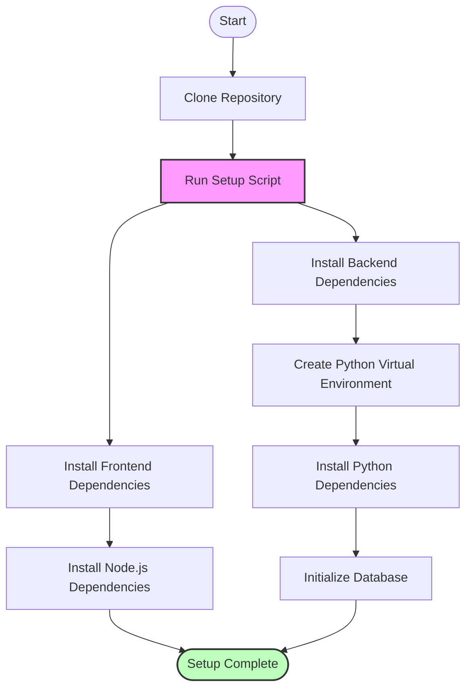
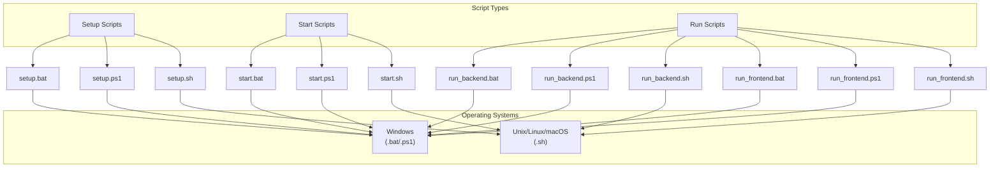
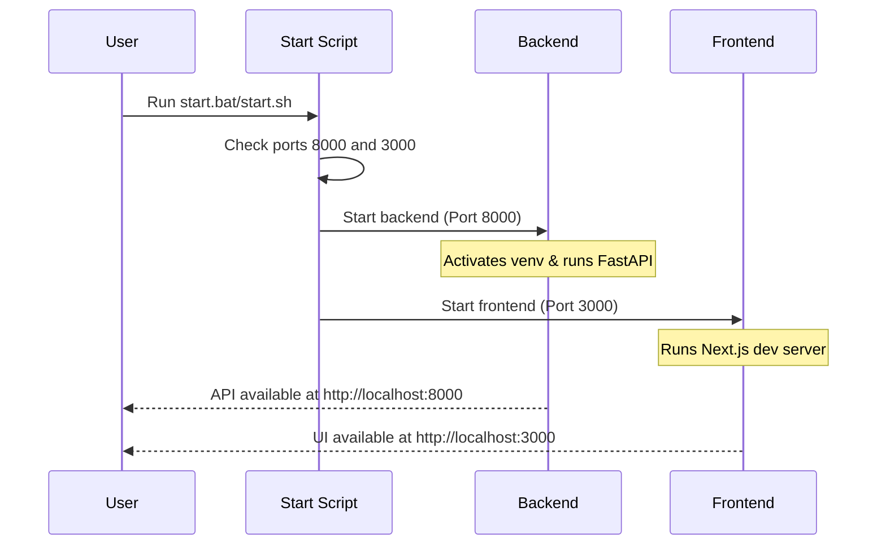
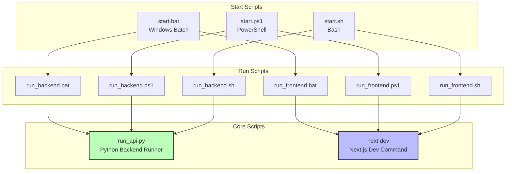
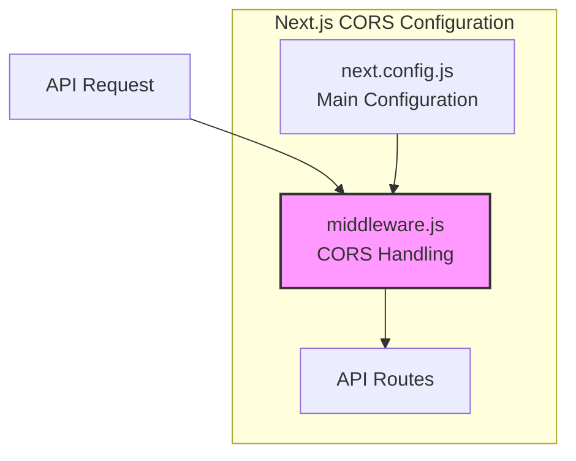

# NotTofu Installation & Setup Guide

This guide provides detailed instructions for setting up and running the NotTofu application on various operating systems.

## System Overview



## Prerequisites

Before installing NotTofu, ensure your system meets the following requirements:

- **Node.js** v16 or later
- **Python** 3.9 or later
- **npm** (comes with Node.js)
- **Git** (for cloning the repository)

## Installation Process



## Available Scripts

NotTofu provides multiple script options for different operating systems:



## Installation Steps

### 1. Clone the Repository

```bash
git clone https://github.com/yourusername/nottofu.git
cd nottofu
```

### 2. Run the Setup Script

#### Windows (Command Prompt)
```
setup.bat
```

#### Windows (PowerShell)
```
.\setup.ps1
```

#### Linux/macOS
```
chmod +x setup.sh
./setup.sh
```

## Running the Application

NotTofu can be started with a single command that launches both the frontend and backend:



### Start with Default Ports

#### Windows
```
start.bat
```

#### Linux/macOS
```
./start.sh
```

### Start with Custom Ports

You can specify custom ports for both the backend and frontend:

#### Windows
```
start.bat 9000 4000
```

#### Linux/macOS
```
./start.sh 9000 4000
```

This will start the backend on port 9000 and the frontend on port 4000.

## Starting Components Individually

If you prefer to start each component separately:

### Backend Server

#### Windows
```
run_backend.bat [port]
```

#### Linux/macOS
```
./run_backend.sh [port]
```

### Frontend Server

#### Windows
```
run_frontend.bat [port]
```

#### Linux/macOS
```
./run_frontend.sh [port]
```

## Script Architecture



## Troubleshooting

### Port Conflicts

If you see an error about ports already in use:

```
Error: Address already in use: bind
```

Use custom ports when starting the application:

```
start.bat 9000 4000  # Windows
./start.sh 9000 4000  # Linux/macOS
```

### Python Environment Issues

If you encounter Python module import errors:

1. Ensure the virtual environment is activated:
   ```
   venv\Scripts\activate  # Windows
   source venv/bin/activate  # Linux/macOS
   ```

2. Reinstall Python dependencies:
   ```
   pip install -r requirements.txt
   ```

### Next.js Configuration

If you see warnings about Next.js configuration:

```
⚠ Invalid next.config.js options detected
```

Check the `frontend/next.config.js` file to ensure it's compatible with your Next.js version.

## Directory Structure

```
/
├── app/                    # Backend API application
├── frontend/               # Next.js frontend application
├── docs/                   # Documentation
├── setup.bat               # Windows setup script
├── setup.ps1               # PowerShell setup script
├── setup.sh                # Unix setup script
├── start.bat               # Windows start script
├── start.ps1               # PowerShell start script
├── start.sh                # Unix start script
├── run_backend.bat         # Windows backend script
├── run_backend.ps1         # PowerShell backend script
├── run_backend.sh          # Unix backend script
├── run_frontend.bat        # Windows frontend script
├── run_frontend.ps1        # PowerShell frontend script
├── run_frontend.sh         # Unix frontend script
├── run_api.py              # Python API runner
├── requirements.txt        # Python dependencies
└── README.md               # Project overview
```

## Next.js 14 Configuration

Next.js 14 introduced some changes to configuration options, particularly around CORS handling. The NotTofu application uses Next.js middleware to manage CORS settings:



### CORS Configuration

In previous versions of Next.js, `allowedDevOrigins` could be specified in the experimental section of the configuration. In Next.js 14, this is handled via middleware:

```javascript
// middleware.js
import { NextResponse } from 'next/server';

export function middleware(request) {
  const response = NextResponse.next();
  
  if (request.nextUrl.pathname.startsWith('/api')) {
    response.headers.append('Access-Control-Allow-Origin', '*');
    response.headers.append('Access-Control-Allow-Methods', 'GET, POST, PUT, DELETE, OPTIONS');
    response.headers.append('Access-Control-Allow-Headers', 'Content-Type, Authorization');
  }
  
  return response;
}
```

This middleware runs on all API routes and sets the appropriate CORS headers, enabling cross-origin access to your API endpoints. 