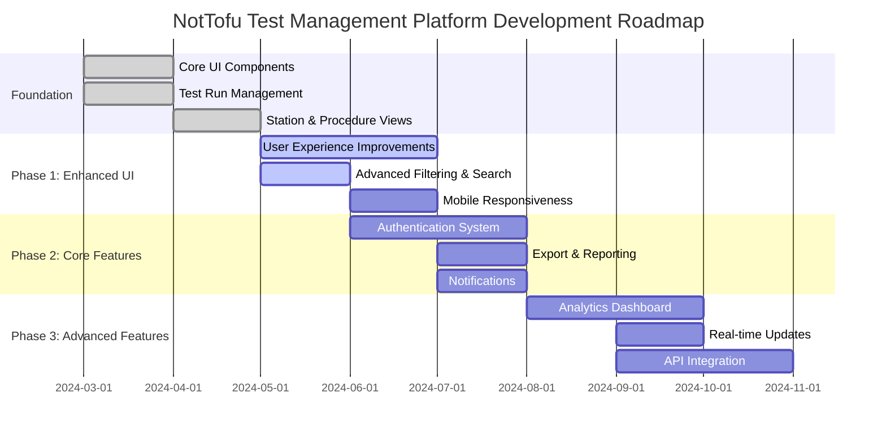
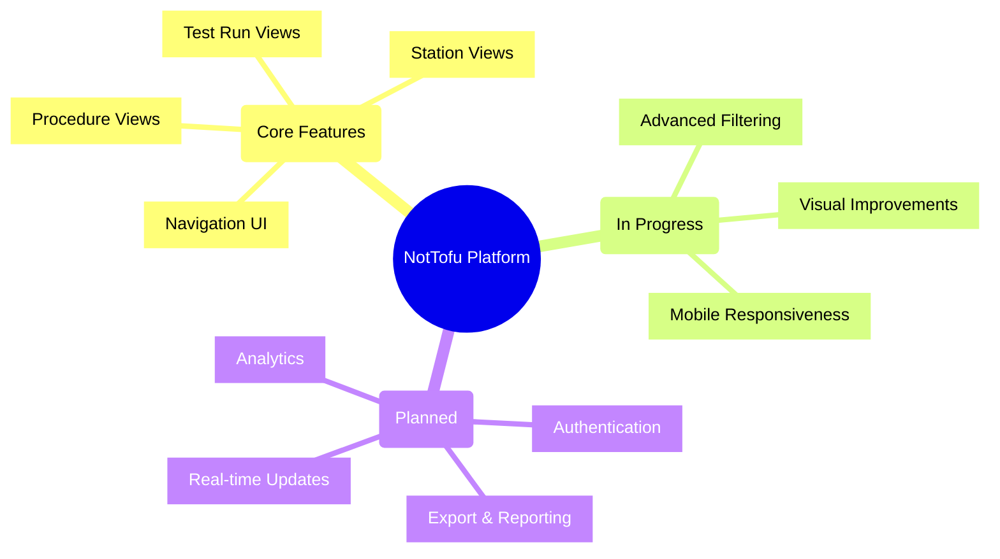

# Development Roadmap

## Project Timeline

## Feature Implementation Status

## Implementation Priorities

### Current Focus (Q2 2024)

1. **User Experience Improvements**
   - ✅ Improved navigation
   - ✅ Consistent component styling
   - 🔄 Advanced filtering and search
   - 🔄 Responsive design optimizations

2. **Data Visualization**
   - 🔄 Test run status visualizations
   - 🔄 Performance metrics
   - 🔄 Timeline views
   - ⏳ Comparative analytics

### Next Phase (Q3 2024)

1. **User Management**
   - User authentication
   - Role-based permissions
   - User profiles and preferences
   - Session management

2. **Content Management**
   - Export options (CSV, PDF, JSON)
   - Report generation
   - Notification system
   - Data archiving

### Future Roadmap (Q4 2024+)

1. **Advanced Features**
   - Analytics dashboard
   - Real-time data updates
   - Integration APIs
   - Advanced search capabilities

2. **Platform Enhancements**
   - Performance optimizations
   - Customization options
   - Mobile application
   - Enterprise features 