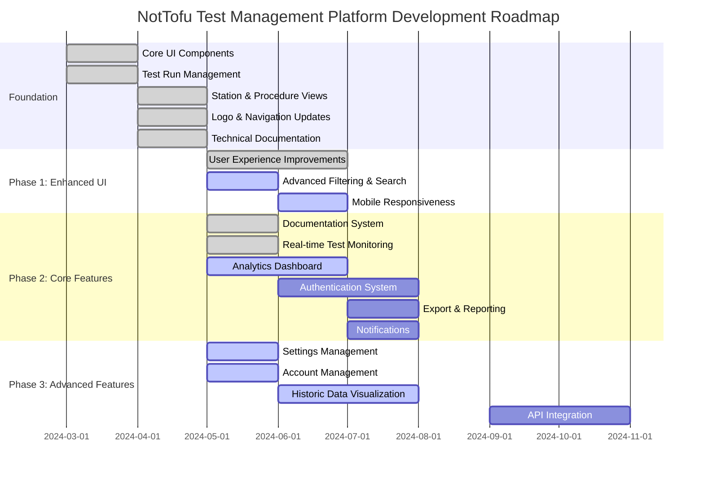
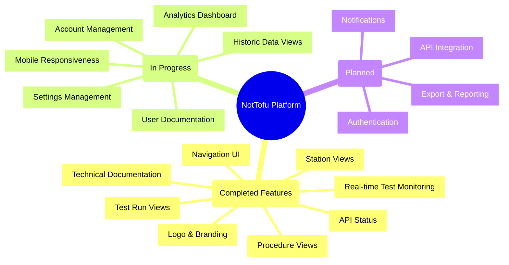

# Development Roadmap

## Project Timeline

## Current Implementation Status

## Feature Roadmap by Area

```mermaid
graph TD
    subgraph "UI and User Experience"
        UI_Nav[Navigation System] --> UI_Mobile[Mobile Responsiveness]
        UI_Nav --> UI_Theme[Theming Options]
        UI_Mobile --> UI_Access[Accessibility Features]
        UI_Theme --> UI_Custom[Custom UI Settings]
    end
    
    subgraph "Data Management"
        DM_Runs[Test Runs] --> DM_RT[Real-time Monitoring]
        DM_Runs --> DM_Hist[Historic Data Analysis]
        DM_RT --> DM_Export[Data Export]
        DM_Hist --> DM_Reports[Custom Reports]
        DM_Export --> DM_Integration[External Integrations]
    end
    
    subgraph "User Management"
        UM_Auth[Authentication] --> UM_Roles[Role-Based Access]
        UM_Auth --> UM_Profiles[User Profiles]
        UM_Roles --> UM_Perms[Fine-grained Permissions]
        UM_Profiles --> UM_Prefs[User Preferences]
    end
    
    subgraph "Analytics and Insights"
        AN_Dash[Analytics Dashboard] --> AN_Custom[Custom Metrics]
        AN_Dash --> AN_Visual[Data Visualizations]
        AN_Custom --> AN_Alerts[Alerts & Thresholds]
        AN_Visual --> AN_Export[Exportable Reports]
    end
    
    subgraph "Documentation"
        DOC_Tech[Technical Documentation] --> DOC_User[User Guides]
        DOC_Tech --> DOC_API[API References]
        DOC_User --> DOC_Tutorials[Tutorial Guides]
        DOC_API --> DOC_Examples[Code Examples]
    end
```

## Implementation Priorities

### Current Focus (Q2 2024)

1. **Dynamic Data Views**
   - ✅ Real-time test monitoring with WebSocket API
   - ✅ Technical documentation with interactive diagrams
   - 🔄 Historic data visualization
   - 🔄 Comparative analysis views
   - 🔄 Time-series data presentation

2. **User Experience Improvements**
   - ✅ Improved navigation with icons
   - ✅ Consistent component styling
   - ✅ Enhanced homepage layout with centered logo
   - 🔄 Mobile responsiveness
   - 🔄 Settings management

3. **Data Visualization & Analytics**
   - 🔄 Analytics dashboard
   - 🔄 Test run metrics
   - 🔄 Station performance tracking
   - 🔄 Procedure success rates

4. **Documentation System**
   - ✅ Technical documentation with architecture diagrams
   - 🔄 User documentation
   - 🔄 API references
   - 🔄 Tutorial guides

### Next Phase (Q3 2024)

1. **User Management**
   - User authentication
   - Role-based permissions
   - User profiles and preferences
   - Session management

2. **Content Management**
   - Export options (CSV, PDF, JSON)
   - Report generation
   - Notification system
   - Data archiving

### Future Roadmap (Q4 2024+)

1. **Advanced Features**
   - Advanced search capabilities
   - Workflow automation
   - Batch operations for test management
   - Custom dashboards

2. **Platform Enhancements**
   - Performance optimizations
   - Customization options
   - Mobile application
   - Enterprise features 