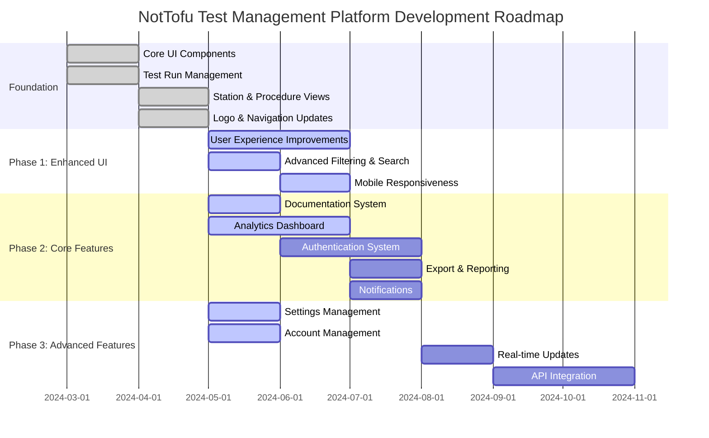
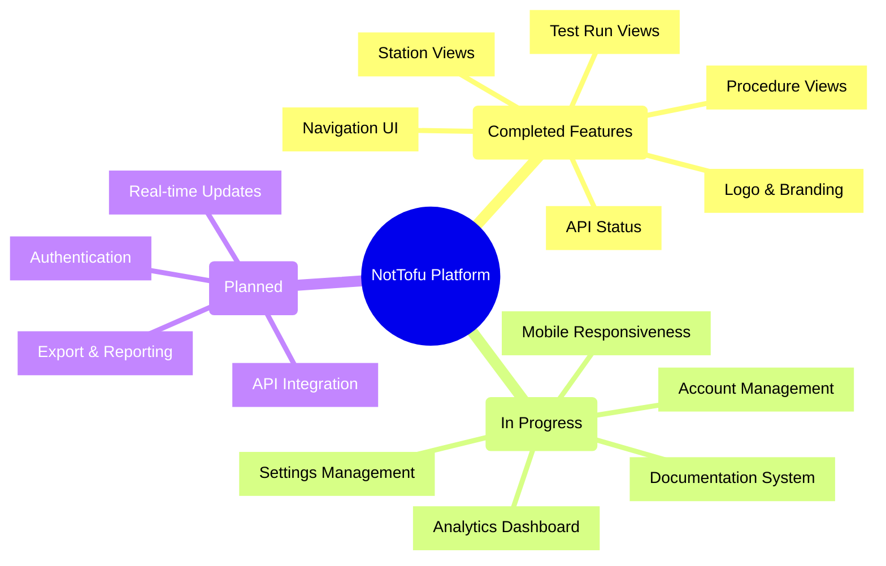

# Development Roadmap

## Project Timeline

## Current Implementation Status

## Feature Roadmap by Area

```mermaid
graph TD
    subgraph "UI and User Experience"
        UI_Nav[Navigation System] --> UI_Mobile[Mobile Responsiveness]
        UI_Nav --> UI_Theme[Theming Options]
        UI_Mobile --> UI_Access[Accessibility Features]
        UI_Theme --> UI_Custom[Custom UI Settings]
    end
    
    subgraph "Data Management"
        DM_Runs[Test Runs] --> DM_Export[Data Export]
        DM_Runs --> DM_Import[Data Import]
        DM_Export --> DM_Reports[Custom Reports]
        DM_Import --> DM_Bulk[Bulk Operations]
    end
    
    subgraph "User Management"
        UM_Auth[Authentication] --> UM_Roles[Role-Based Access]
        UM_Auth --> UM_Profiles[User Profiles]
        UM_Roles --> UM_Perms[Fine-grained Permissions]
        UM_Profiles --> UM_Prefs[User Preferences]
    end
    
    subgraph "Analytics and Insights"
        AN_Dash[Analytics Dashboard] --> AN_Custom[Custom Metrics]
        AN_Dash --> AN_Visual[Data Visualizations]
        AN_Custom --> AN_Alerts[Alerts & Thresholds]
        AN_Visual --> AN_Export[Exportable Reports]
    end
```

## Implementation Priorities

### Current Focus (Q2 2024)

1. **User Experience Improvements**
   - ✅ Improved navigation
   - ✅ Consistent component styling
   - ✅ Enhanced homepage layout
   - 🔄 Mobile responsiveness
   - 🔄 Settings management

2. **Data Visualization & Analytics**
   - 🔄 Analytics dashboard
   - 🔄 Test run metrics
   - 🔄 Station performance tracking
   - 🔄 Procedure success rates

3. **Documentation System**
   - 🔄 User documentation
   - 🔄 System architecture diagrams
   - 🔄 API references
   - 🔄 Tutorial guides

### Next Phase (Q3 2024)

1. **User Management**
   - User authentication
   - Role-based permissions
   - User profiles and preferences
   - Session management

2. **Content Management**
   - Export options (CSV, PDF, JSON)
   - Report generation
   - Notification system
   - Data archiving

### Future Roadmap (Q4 2024+)

1. **Advanced Features**
   - Real-time data updates
   - Integration APIs
   - Advanced search capabilities
   - Workflow automation

2. **Platform Enhancements**
   - Performance optimizations
   - Customization options
   - Mobile application
   - Enterprise features 